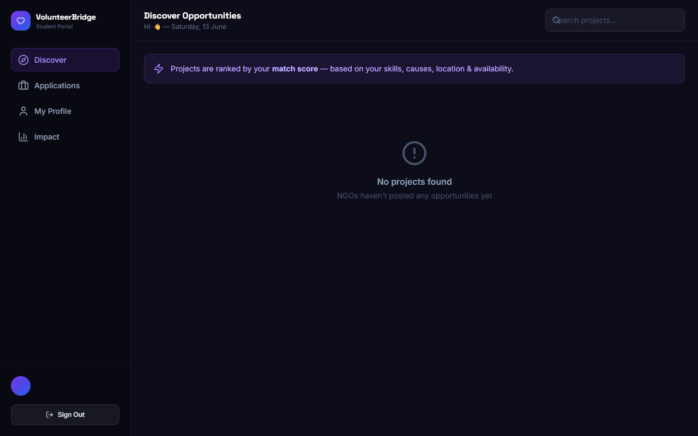
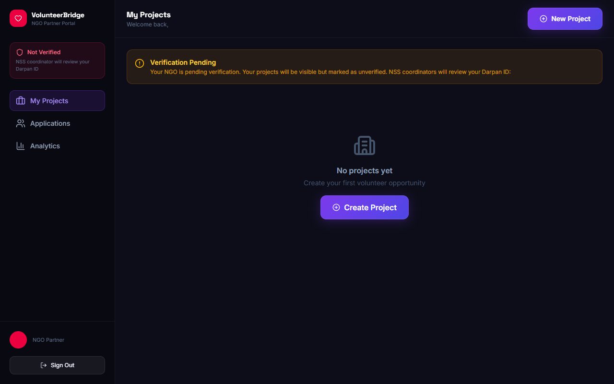
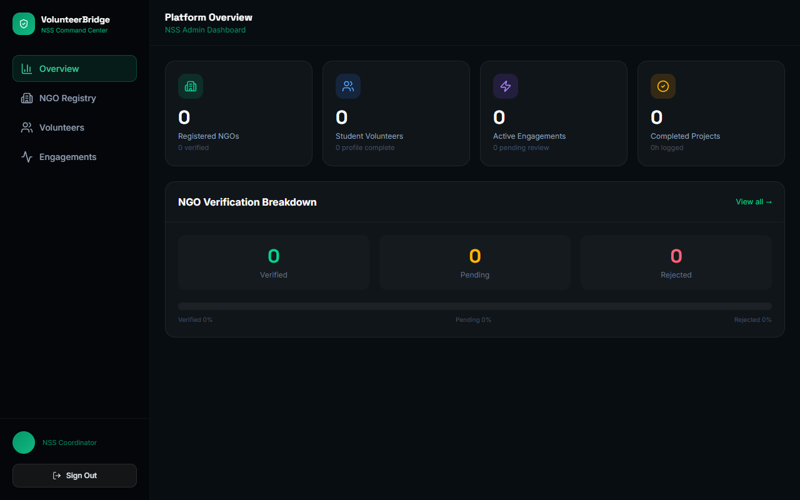

<div align="center">
  <h1>🤝 VolunteerBridge</h1>
  <p><strong>NSS Volunteer-NGO Matching Platform</strong></p>
  <p>Connecting India's 4 crore+ college students with NGOs through intelligent skill-matching.</p>
</div>

---

## 📖 Overview

VolunteerBridge eliminates the volunteer-NGO mismatch through three core mechanisms:
1. **Intelligent Matching**: A rules-based algorithm that scores every project for each student based on skills, cause, location, and availability.
2. **Verified Ecosystem**: A Darpan ID verification pipeline managed by NSS coordinators.
3. **End-to-End Lifecycle**: A complete application lifecycle from *apply* -> *active* -> *complete* -> *feedback* -> *certificate*.

## 🚀 Dashboards

### Student Volunteer Portal
*Intelligent discover & matching, tracking impact hours, and easy onboarding.*


### NGO Program Coordinator Portal
*Structured applicant tracking, verifiable skill-sets, and bulk accept/reject features.*


### NSS Programme Officer Portal
*Overview of enrolled students, aggregated impact metrics, and easy approval workflows.*


## 🛠️ Technology Stack
- **Frontend**: React 19, Vite, TailwindCSS 4, Framer Motion
- **Backend & Auth**: Firebase Authentication, Firestore
- **Deployment**: Vercel / Netlify

## 🏃‍♂️ Getting Started

### Prerequisites
- Node.js (v18 or higher)
- npm or yarn

### Installation

1. Clone the repository
```bash
git clone https://github.com/curiousvolt/volunteerbridge.git
cd volunteer-bridge
```

2. Install dependencies
```bash
npm install
```

3. Environment Setup
Rename `.env.example` to `.env` and add your Firebase configuration details:
```
VITE_FIREBASE_API_KEY=your_api_key
VITE_FIREBASE_AUTH_DOMAIN=your_auth_domain
VITE_FIREBASE_PROJECT_ID=your_project_id
VITE_FIREBASE_STORAGE_BUCKET=your_storage_bucket
VITE_FIREBASE_MESSAGING_SENDER_ID=your_messaging_sender_id
VITE_FIREBASE_APP_ID=your_app_id
```

4. Run the development server
```bash
npm run dev
```

## 🤝 Contributing
Contributions, issues, and feature requests are welcome!

---
*Built to streamline the National Service Scheme (NSS) volunteering ecosystem.*
